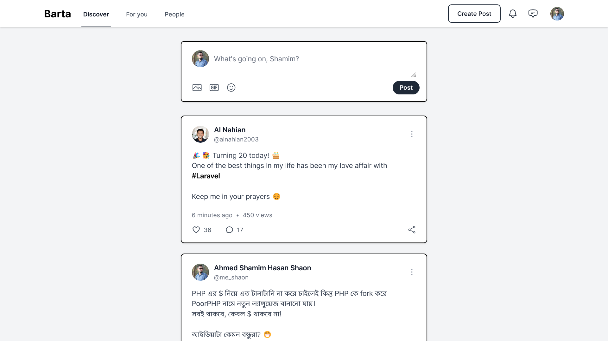
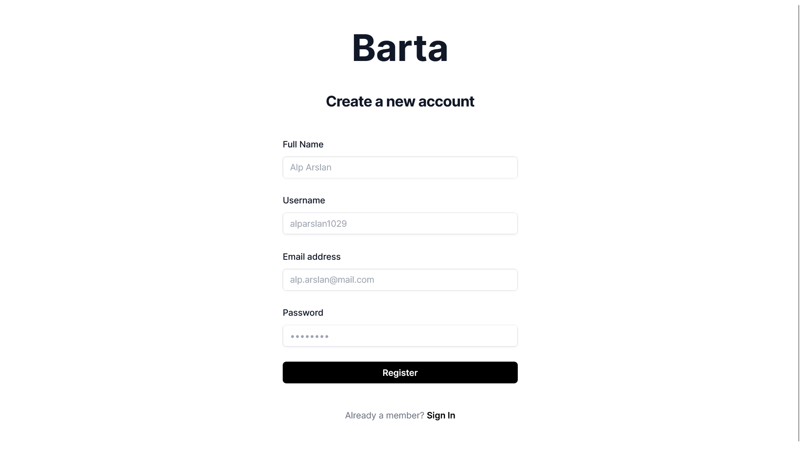
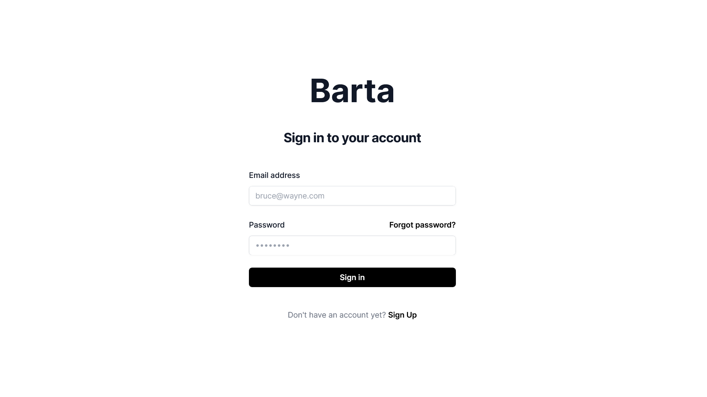

# Barta — Laravel Implementation of Starter HTML Template

Barta App is a MySQL database driven Laravel Implementation of A minimal, elegant social media starter template built with Tailwind CSS.

<details>
<summary>Screenshots</summary>





</details>

## Requirements

Before proceeding with the installation, ensure that your system meets the following requirements:

- **PHP >= 8.1** ([Download PHP](https://www.php.net/downloads.php))
- **Composer** ([Download Composer](https://getcomposer.org/download/))
- **Laravel 11** ([Laravel Installation Guide](https://laravel.com/docs/11.x/installation))
- **MySQL** ([MySQL Installation Guide](https://www.mysql.com/downloads/))
- **Node.js & NPM** ([Node.js Downloads](https://nodejs.org/en/))
- **Git** ([Git Installation Guide](https://git-scm.com/downloads))

## Getting Started

These instructions will get you a copy of the project up and running on your local machine for development and testing purposes.

### Installing

Clone the repo

```
git clone https://github.com/hasanhafiz/icare_assignment09_barta_app.git
```

Create database

```
CREATE DATABASE `icare_assignment09_barta_app`
```

Run Migrations: Migrate the database to create the necessary tables.

```
php artisan migrate --seed
```

Create the symbolic link: In order to access user upload image publically, create symbolic link

```
php artisan storage:link

``````

Run the Application: Start the Laravel development server to run the app locally.

```
php artisan serve

``````

Access the Application: Open a web browser and visit the following URL:

```
http://localhost:8000
```